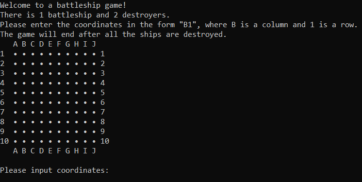
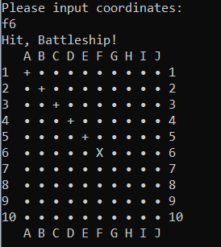
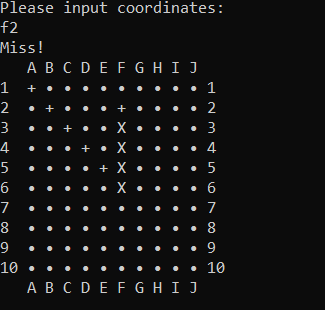
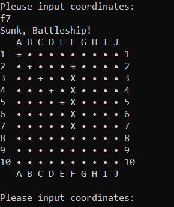
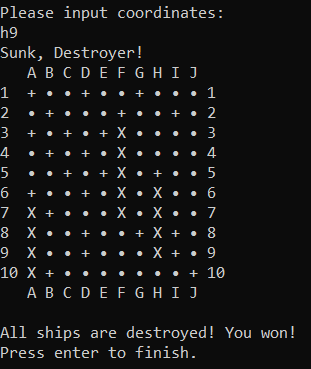

# Battleship

Battleship is an application, which consists from core libraries and models that represent battleship game. 
There is also a console interface to interact with the game.

Battleships game description, as well as requirements can be found [here](https://medium.com/guestline-labs/hints-for-our-interview-process-and-code-test-ae647325f400).

## Features

- Console application has a good visualisation
- Application core is designed with Domain-Driven Design.
- Use of functional programming principles to secure domain from wrong usage.
- Project covered with unit tests.
- Strict policy about errors. Exceptions represent unexpected system error or error caused by developer mistake. 
- Possible game errors are handled in a generic way

## Tech

- .NET 6
- C# 10
- xUnit & FluentAssertions - test execution & assertions

Battleship code is on a [public repository](https://github.com/ArtyomKolosov2/Battleship) on GitHub.

## How to start

**To start the application you should have a .NET 6 runtime installed on your machine**

- Navigate to a folder with the solution code
- Build the solution `dotnet build Battleship.sln`
- Go to folder with the results of the build of Battleship.ConsoleApplication `{SolutionRoot}\Battleship.ConsoleApplication\bin\Debug\net6.0`
- Use `dotnet Battleship.ConsoleApplication.dll` or find and open `Battleship.ConsoleApplication.exe`

## Screenshots of Battleship game

### Start

### Hit

### Miss
    

### Sunk

### Win

